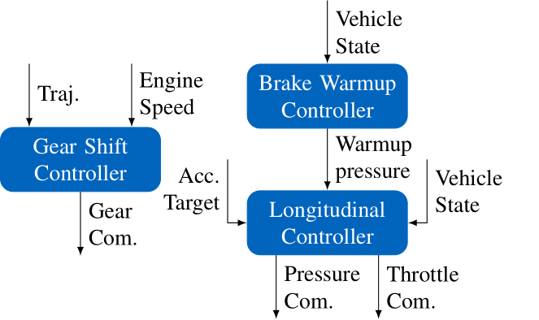
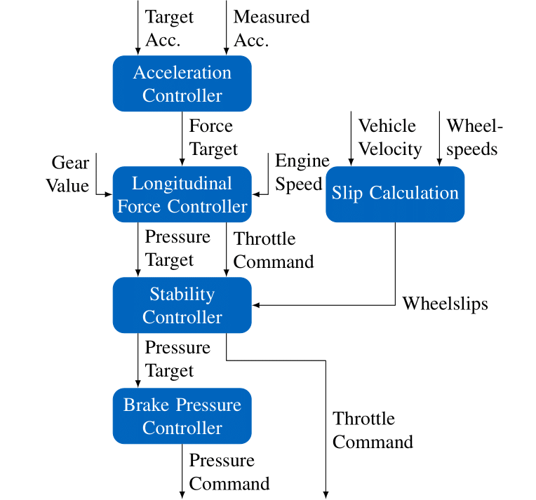

# TAM__long_acc_control

[](https://www.linux.org/)
[](https://www.docker.com/)
[](https://docs.ros.org/en/humble/index.html)
[](https://doi.org/10.1109/IV64158.2025.11097559)
[](https://doi.org/10.5281/zenodo.21899629)

This package provides a Longitudinal Controller for a Combustion Engine Vehicle consisting of multiple feedforward and feedback parts. It takes a longitudinal acceleration as input and outputs wheel individual brake pressures, a throttle and a gear command. 

## Structure of the Longitudinal Control System

The figure below shows the structure of the longitudinal control system consisting of a gear shift controller, brake warmup controller and longitudinal controller.



The longitudinal controller itself is composed of multiple submodules as shown in the Figure below.



## Running the Code
To run the code make sure having ROS2 installed - the code was developed and tested using ROS2-Humble. Before you build the code make sure you have initialized all git submodules.

The parameters can be configured in the files in the config folder. All parameters that are not defined in a parameter file will default to the values in the code.

### Local
Build the Code using colcon:

```bash
colcon build --packages-up-to brake_temperature_controller_node_cpp gear_shift_controller_node_cpp longitudinal_controller_node_cpp
```

Launch the nodes individually:
- Longitudinal Controller:
```bash
source install/setup.zsh && ros2 run longitudinal_controller_node_cpp longitudinal_controller_node --ros-args --params-file config/longitudinal_controller_config.yml --params-file config/dummy_engine_map.yml
```
- Gear Shift Controller:
```bash
source install/setup.zsh &&  ros2 run gear_shift_controller_node_cpp gear_shift_controller_node --ros-args --params-file config/gear_shift_controller_config.yml
```
- Brake Temperature Controller:
```bash
source install/setup.zsh && ros2 run brake_temperature_controller_node_cpp brake_temperature_controller_node --ros-args --params-file config/brake_temperature_controller_config.yml
```

### Docker
Build the docker image:
```bash
docker build -f docker/Dockerfile -t longcontrol:v1 . 
```

Run the containers:

```bash
docker compose -f docker/compose-file.yml up
```

## References

If you use the Longitudinal Controller in your work please consider citing our paper:

[Longitudinal Control for Autonomous Racing with Combustion Engine Vehicles](https://ieeexplore.ieee.org/document/11097559)


```
@INPROCEEDINGS{pitschi2025,
  author={Pitschi, Phillip and Sagmeister, Simon and Goblirsch, Sven and Lienkamp, Markus and Lohmann, Boris},
  booktitle={2025 IEEE Intelligent Vehicles Symposium (IV)}, 
  title={Longitudinal Control for Autonomous Racing with Combustion Engine Vehicles}, 
  year={2025},
  volume={},
  number={},
  pages={1070-1077},
  keywords={Target tracking;Gears;Trajectory tracking;Wheels;Combustion;Safety;Brakes;Vehicle dynamics;Engines;Autonomous vehicles},
  doi={10.1109/IV64158.2025.11097559}
}
```

A preprint of the published paper is available on [arXiv](https://arxiv.org/abs/2504.17418).

## Contact

- [Phillip Pitschi](phillip.pitschi@tum.de)
- [Simon Sagmeister](simon.sagmeister@tum.de)
- [Sven Goblirsch](sven.goblirsch@tum.de)

## Ackknowledgements

We thank A2RL, the IAC and the TUM Autonomous Motorsports team for their support during the data acquisition and the development of the introduced longitudinal controller. Special thanks to Clemens Herrmann, Frederik Werner and Tobias Betz for their help and feedback with the implementation of the code.